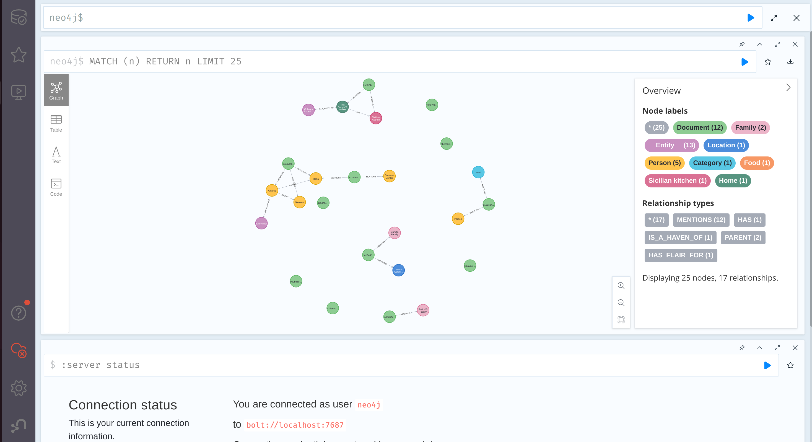

# Graph RAG Query with Local Llama3.1




## 🚀 Getting Started

Follow these instructions to set up and run the Document App on your local machine.

### 1. Clone the Repository

```bash
git clone https://github.com/aenodehi/GraphRAG_Local_Llama3.git
cd Document-App

docker compose up -d

ollama run llama3.1

execute jupyter cell by cell

```

Happy coding! 🚀✨
